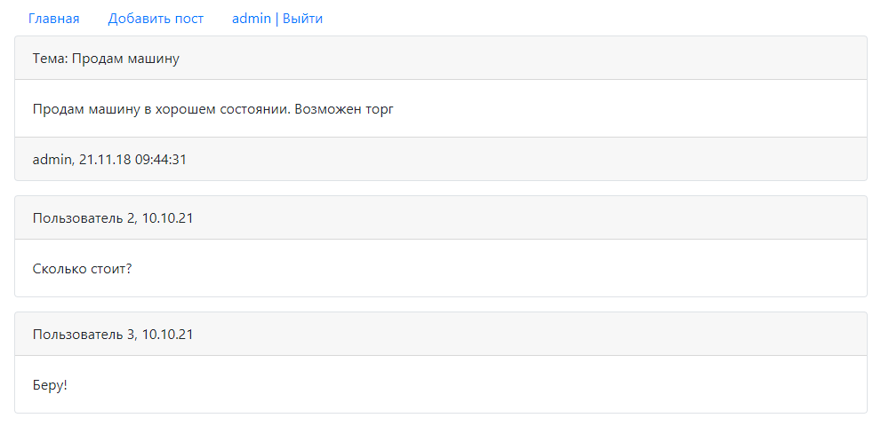

# Project job4j_forum
[](https://app.travis-ci.com/EDGE775/job4j_forum)
[](https://codecov.io/gh/EDGE775/job4j_forum)

## Table of contents
* [General info](#general-info)
* [Technologies](#technologies)
* [Installation](#installation)
* [Status](#status)
* [Screenshots](#screenshots)
* [Contact](#contact)

## General info
This app is a simple forum. 
Each user can add new topics on the forum, edit them and add comments. 
The application contains authorization and registration.

## Technologies
* Java 17
* Spring Boot(Data, Security, Test)
* PostgreSQL, H2 (for tests)
* Liquibase
* Apache TomCat
* HTML, Bootstrap, JSP, JSTL
* Maven
* Heroku
* Junit

## Installation
```
mvn install
```

## Status
Project is: _in progress_

## Screenshots
#### Main page

#### Topic page

#### Create topic

#### Registration

#### Authorization


## Contact
Created by Khlapov Dmitry - feel free to contact me!
